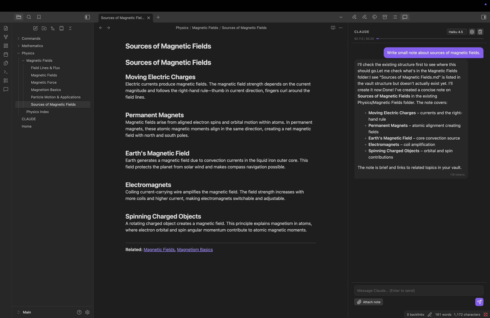
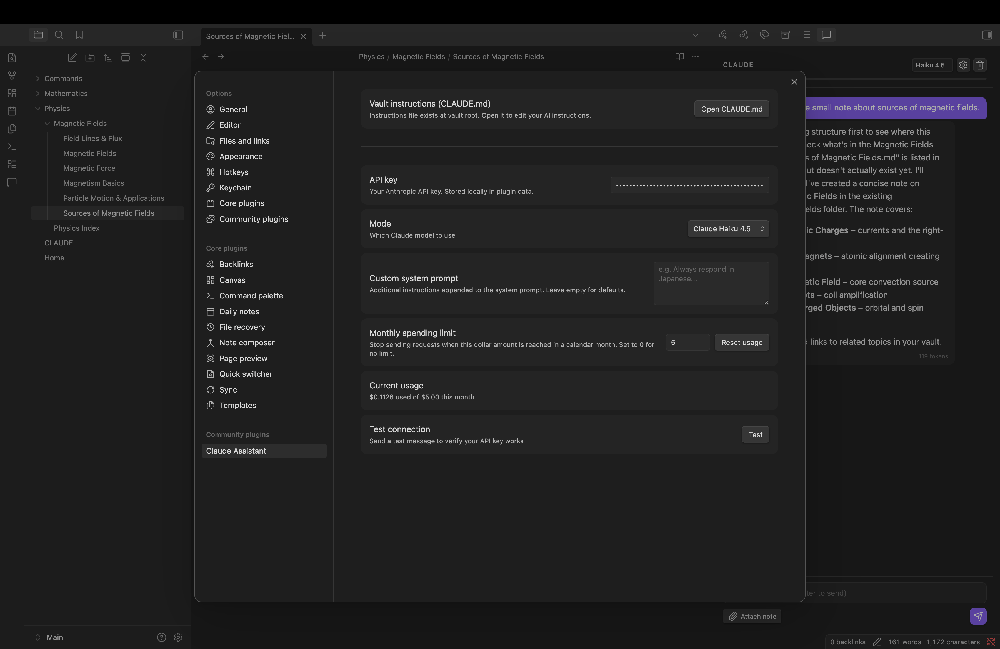

# Claudesidian

An Obsidian plugin that integrates Claude AI directly into your vault. Chat with Claude in a sidebar, run writing commands on your notes, and let Claude read and modify your vault through tool calling.





---

## First Start

### 1. Install the plugin

Copy these three files into your vault's plugin folder:

```
<your-vault>/.obsidian/plugins/claudesidian/
  main.js
  manifest.json
  styles.css
```

Then in Obsidian: **Settings → Community plugins → turn off Restricted mode → enable Claudesidian**.

### 2. Add your API key

Open **Settings → Claudesidian** and paste your Anthropic API key into the **API key** field.
Get a key at [console.anthropic.com](https://console.anthropic.com).

Click **Test** to verify the connection.

### 3. Choose a model

Two models are available:

| Model | Speed | Cost |
|---|---|---|
| Claude Sonnet 4.6 | Fast | $3 / $15 per 1M tokens |
| Claude Haiku 4.5 | Fastest | $1 / $5 per 1M tokens |

You can also switch models directly from the chat sidebar at any time.

### 4. Create your instructions file (optional but recommended)

Go to **Settings → Claudesidian** and click **Create CLAUDE.md**.
This creates a `CLAUDE.md` file at your vault root and opens it for editing.

Fill in the template to tell Claude about your vault — its purpose, your writing style preferences, formatting rules, and any behaviours you want to enforce. Claude reads this file automatically on every request.

You can also place a `CLAUDE.md` inside any subfolder. Claude will merge instructions from the vault root through every parent folder of the active note, with more specific (local) instructions taking priority.

### 5. Set a spending limit (optional)

In **Settings → Claudesidian**, set a **Monthly spending limit** in dollars. Claude will stop accepting new messages once the limit is reached. The counter resets automatically on the first of each month. You can reset it manually at any time with the **Reset usage** button.

---

## Features

### Chat sidebar

Open the chat panel from the ribbon icon (💬) or via **Command Palette → Open Claude Chat**.

- **Model switcher** — change between Sonnet and Haiku without leaving the chat
- **Attach note** — click the paperclip button to attach the currently open note as context for your next message. The note name appears as a chip; click × to detach before sending
- **Usage bar** — shows current monthly spend vs your limit as a thin progress bar under the header. Turns red when the limit is reached
- **Token count** — each Claude response shows the number of output tokens at the bottom of the bubble
- **Clear** — trash icon clears the conversation history (session only, not persisted)
- **Settings shortcut** — gear icon opens the settings page directly

Messages support full Markdown rendering — headings, bold, code blocks, lists, and links all display correctly in Claude's responses.

Claude uses vault tools silently in the background. Notices appear when files are created or modified.

### Writing commands

Three commands are available via the Command Palette (`Cmd/Ctrl+P`):

| Command | What it does |
|---|---|
| **Continue writing** | Takes text before the cursor and streams a continuation |
| **Summarize note** | Summarizes the full content of the current note |
| **Improve / rewrite selection** | Rewrites the selected text while preserving its meaning |

All three commands open a **preview modal** before applying any changes:
- The original text is shown on top
- Claude's suggestion streams in below in real time
- **Accept** — applies the change to the editor
- **Retry** — generates a new suggestion
- **Cancel** — discards and closes

### Vault tools (agentic loop)

When asked, Claude can interact with your vault directly:

| Tool | What it does |
|---|---|
| `list_files` | Lists files in a folder |
| `read_note` | Reads the full content of a note |
| `create_note` | Creates a new note with given content |
| `update_note` | Replaces the content of an existing note |
| `search_notes` | Full-text search across all notes |
| `get_vault_structure` | Returns the folder tree |

### CLAUDE.md instruction system

Claude loads instructions from `CLAUDE.md` files on every request:

1. `CLAUDE.md` at vault root (global instructions)
2. `CLAUDE.md` in each parent folder of the currently active note (local overrides)

Files are merged from global → local. Changes take effect immediately.

---

## How it works

```
User message
    │
    ▼
Build system prompt
  ├─ Base instructions
  ├─ CLAUDE.md hierarchy (vault root → active note's parent folders)
  └─ Custom system prompt (from settings)
    │
    ▼
Anthropic API (streaming)
    │
    ├─ Text chunks → displayed incrementally in the chat bubble
    │
    └─ Tool calls (if any)
         ├─ Execute against app.vault
         ├─ Show Obsidian Notice
         └─ Feed result back → loop until Claude stops calling tools
    │
    ▼
Usage recorded (tokens → dollars, persisted monthly)
```

---

## Settings reference

| Setting | Description |
|---|---|
| API key | Your Anthropic API key. Stored in plugin data, never logged |
| Model | Claude Sonnet 4.6 or Haiku 4.5 |
| Custom system prompt | Extra instructions appended to every request |
| Monthly spending limit | Block requests above this dollar amount (0 = no limit) |
| Current usage | Dollars spent this calendar month |
| Reset usage | Manually zero the usage counter |
| CLAUDE.md | Create or open the vault instruction file |
| Test connection | Send a ping to verify your API key |

---

## Privacy & security

- The API key is stored via Obsidian's plugin data (`data.json`) and is never logged or exposed
- Note content is only sent to Anthropic when you explicitly attach a note or Claude calls a vault tool
- `data.json` is listed in `.gitignore` so it won't be committed to version control
- The plugin is desktop-only (`isDesktopOnly: true`)
